## Rebol/AGG `draw` dialect code examples

Using following assets:
```rebol
img-size: 480x480 
center:  img-size / 2
points:  #(f64! [100 100  100 380  380 380  380 100])
points2: skip points 2
points-blk:  [100x100  100x380  380x380  380x100]
points-in-block: [
    0x200 2x198.056 4x196.544 6x195.464 8x194.816 10x194.6 12x194.816 14x195.464 16x196.544 18x198.056
    20x200 22x196.073 24x192.628 26x189.667 28x187.188 30x185.191 32x183.677 34x182.646 36x182.098 38x182.032
    40x182.449 42x183.348 44x184.73 46x186.595 48x188.943 50x191.773 52x195.086 54x198.881 56x195.296 58x189.142
    60x183.35 62x177.922 64x172.856 66x168.154 68x163.814 70x159.838 72x156.224 74x152.974 76x150.086 78x147.562
    80x145.4 82x143.602 84x142.166 86x141.094 88x140.384 90x140.038 92x140.054 94x140.434 96x141.176 98x142.282
    100x143.75 102x145.582 104x147.776 106x150.334 108x153.254 110x156.538 112x160.184 114x164.194 116x168.566 118x173.302
    120x178.4 122x183.862 124x189.686 126x195.874 128x196.02 130x185.281 132x174.845 134x164.711 136x154.88 138x145.351
    140x136.125 142x127.201 144x118.58 146x110.261 148x102.245 150x94.531 152x87.12 154x80.011 156x73.205 158x66.701
    160x60.5 162x54.601 164x49.005 166x43.711 168x38.72 170x34.031 172x29.645 174x25.561 176x21.78 178x18.301
    180x15.125 182x12.251 184x9.68 186x7.411 188x5.445 190x3.781 192x2.42 194x1.361 196x0.605 198x0.151
    200x0
]
triangles: [50x50 240x240 50x430 430x50 240x240 430x430]
text: "The quick brown fox jumps over the lazy dog. 123456780"
fontname: "/usr/share/fonts/truetype/dejavu/DejaVuSans.ttf" 

gnome:   load %assets/gnome.png
fish:    load %assets/fish.png
texture: load %assets/texture.jpeg

rotate-45-around-center: #(double! [0.707107 0.707107 -0.707107 0.707107 240.000000 -99.411255])

pentagram: [
    move 0x-150        ;; Top point
    line-by 88x271     ;; To bottom-right
    line-by -231x-167  ;; To left
    line-by 286x0      ;; To right
    line-by -231x167   ;; To bottom-left
    line-by 88x-271    ;; Back to top
]

```
* * * *


### none
```rebol
draw 480x480 [none
]
```
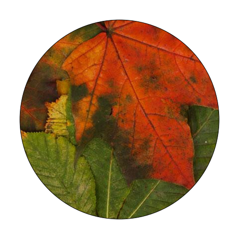


### none
```rebol
draw 480x480 [none
]
```
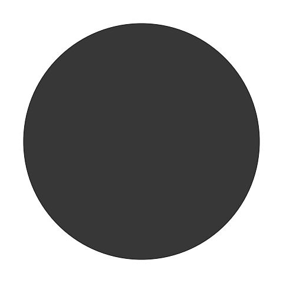


### none
```rebol
draw 480x480 [none
]
```
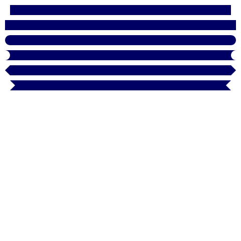


### none
```rebol
draw 480x480 [none
]
```
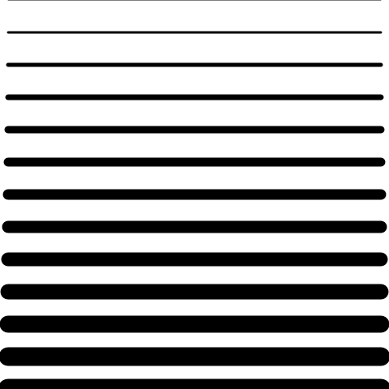


### none
```rebol
draw 480x480 [none
]
```
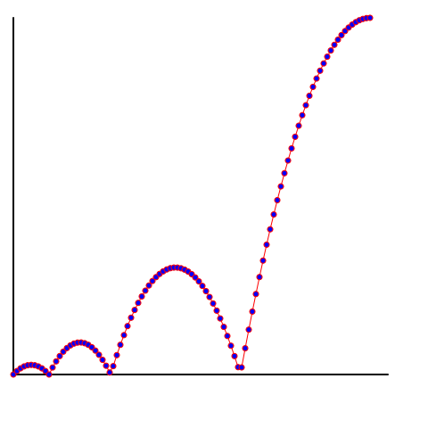


### none
```rebol
draw 480x480 [none
]
```
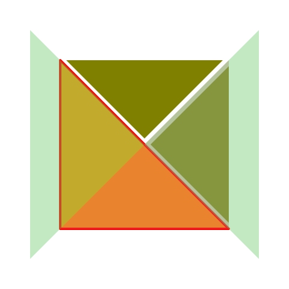


### none
```rebol
draw 480x480 [none
]
```
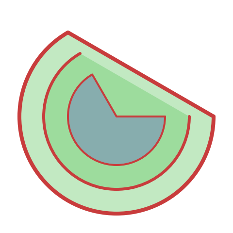


### none
```rebol
draw 480x480 [none
]
```
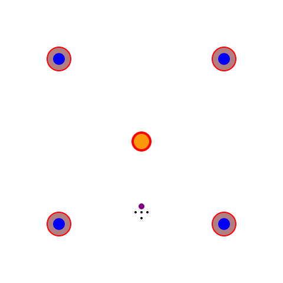


### none
```rebol
draw 480x480 [none
]
```
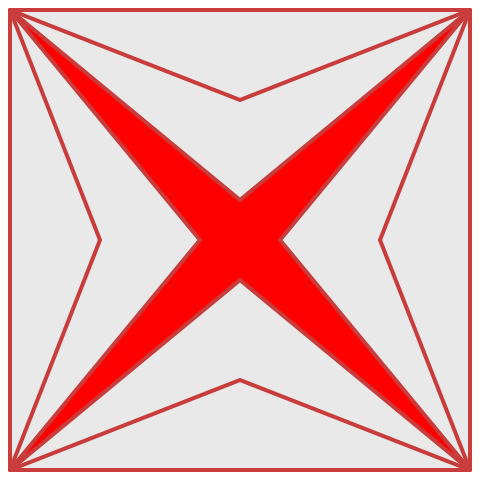


### none
```rebol
draw 480x480 [none
]
```
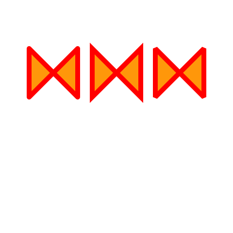


### none
```rebol
draw 480x480 [none
]
```
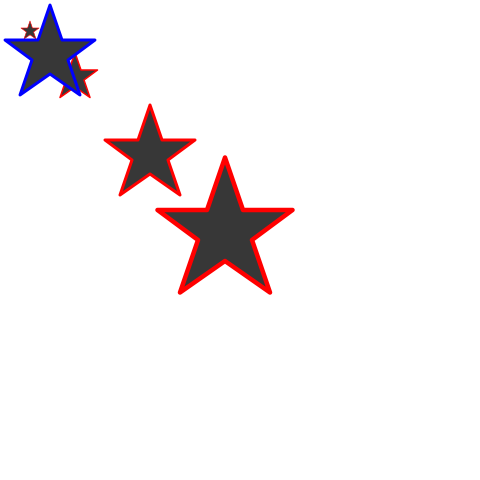


### none
```rebol
draw 480x480 [none
]
```
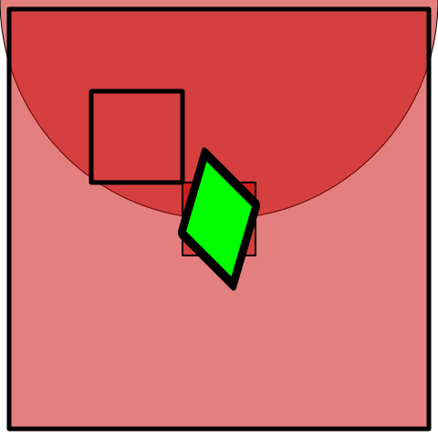


### none
```rebol
draw 480x480 [none
]
```
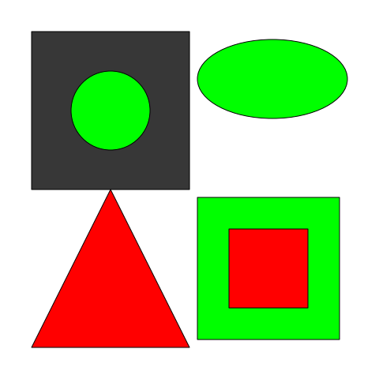


### none
```rebol
draw 480x480 [none
]
```
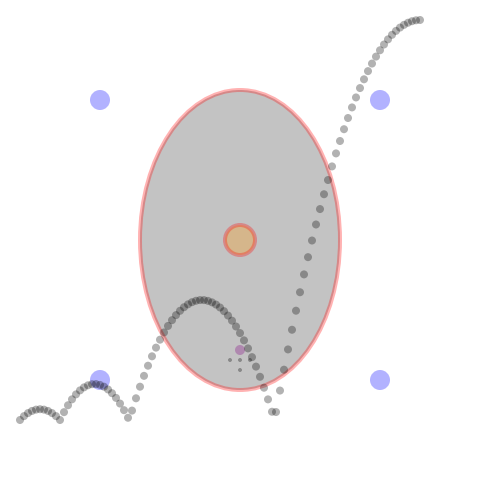


### none
```rebol
draw 480x480 [none
]
```
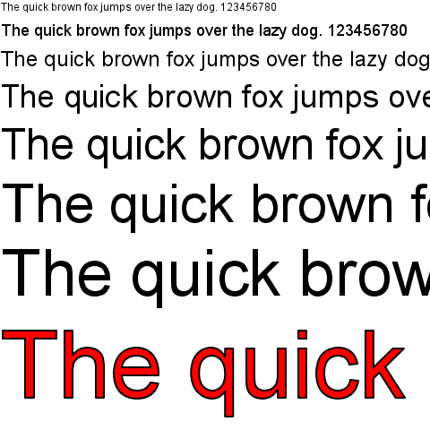


### none
```rebol
draw 480x480 [none
]
```
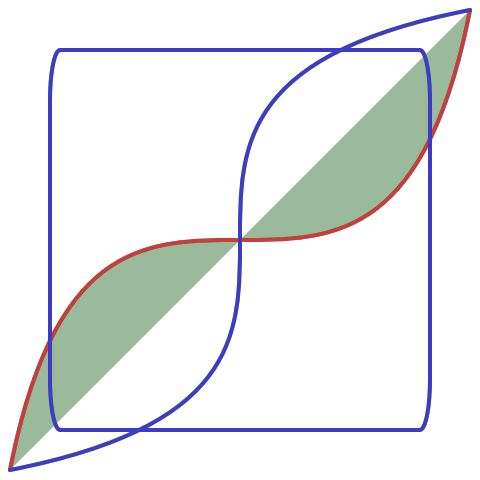


### none
```rebol
draw 480x480 [none
]
```
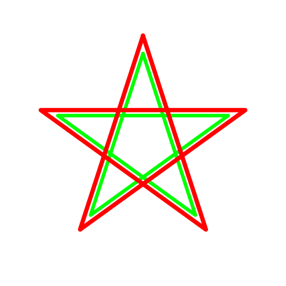


### none
```rebol
draw 480x480 [none
]
```
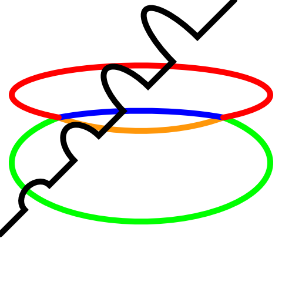


### none
```rebol
draw 480x480 [none
]
```
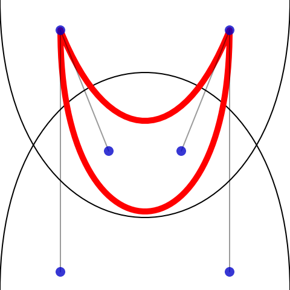


### none
```rebol
draw 480x480 [none
]
```
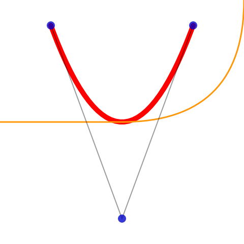


### none
```rebol
draw 480x480 [none
]
```
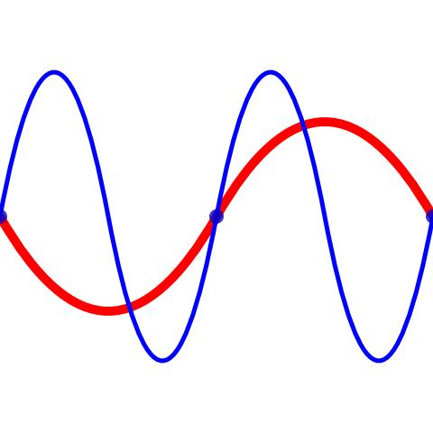


### none
```rebol
draw 480x480 [none
]
```
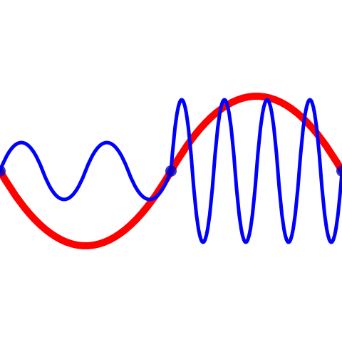


### none
```rebol
draw 480x480 [none
]
```
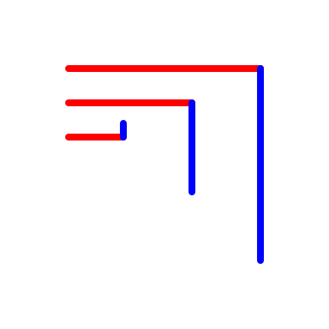


### none
```rebol
draw 480x480 [none
]
```
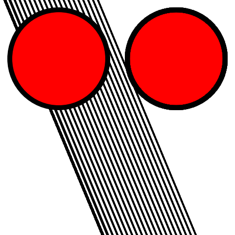


### none
```rebol
draw 480x480 [none
]
```
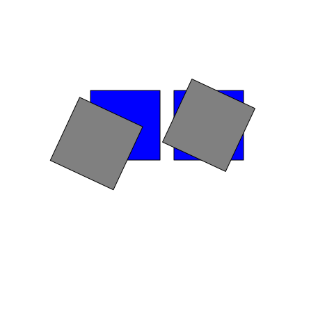


### none
```rebol
draw 480x480 [none
]
```
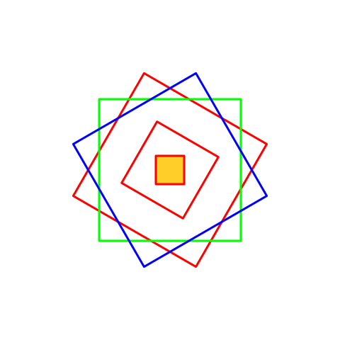


### none
```rebol
draw 480x480 [none
]
```
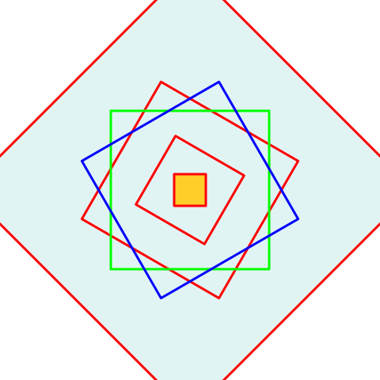


### none
```rebol
draw 480x480 [none
]
```
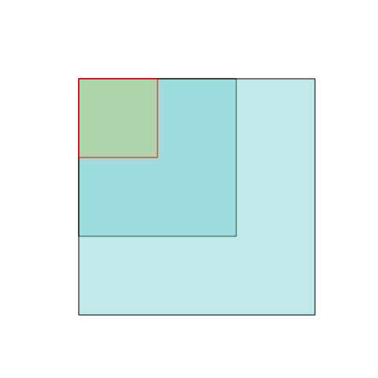


### none
```rebol
draw 480x480 [none
]
```
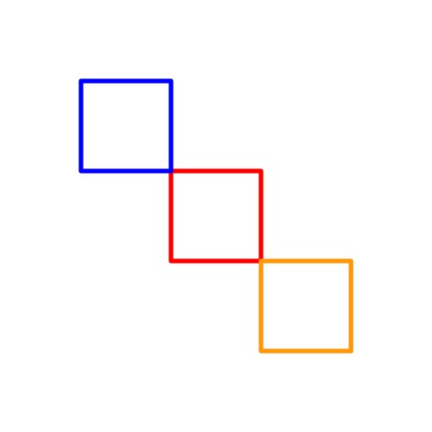


### none
```rebol
draw 480x480 [none
]
```


### none
```rebol
draw 480x480 [none
]
```


### none
```rebol
draw 480x480 [none
]
```
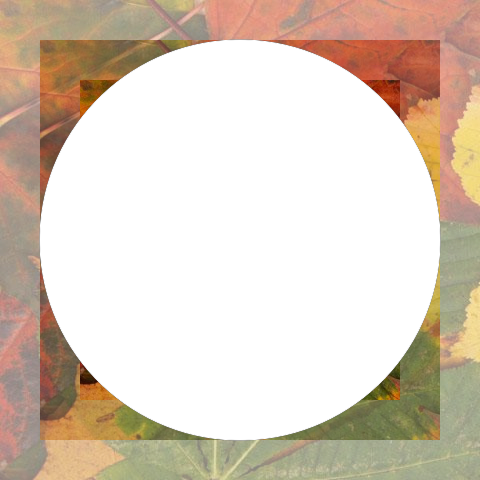


### none
```rebol
draw 480x480 [none
]
```
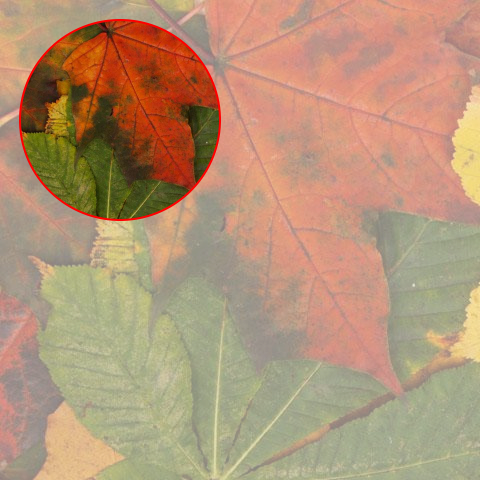


### none
```rebol
draw 480x480 [none
]
```


* * * *
This file was generated using [examples.r3](examples.r3) script.
